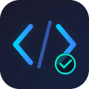

<p align="center">
  日本語 | <a href="README.md">English</a>
</p>

<p align="center">
  
</p>

<h1 align="center">CodePractice</h1>

<p align="center">
  <strong>VS Code向け AI搭載コーディング練習ジェネレーター</strong><br>
  問題生成・コード実行・自動採点・進捗管理を、すべてエディタ内で完結できます。
</p>

<p align="center">
  <a href="https://codespaces.new/barankul/codepractice?quickstart=1">
    
  </a>
</p>

<p align="center">
  
  
  
  
</p>

---

## なぜ CodePractice？

多くのコーディング練習サービスはブラウザ上で動きます。CodePractice は **VS Code の中** に練習環境を持ち込みます。ブラウザとの行き来は不要です。問題を生成し、そのままエディタで解き、自動採点で即座にフィードバックを受け、間隔反復で進捗を管理できます。

**主な特徴:**
- APIキー不要で **完全オフライン** 動作。138個の組み込み問題、ローカライズ済みの問題文、検証済みのオフライン bug-fix 問題を利用可能
- **8つのAIプロバイダー** に対応し、毎回異なる練習問題を生成可能
- **コードランナー内蔵**。Java、TypeScript、SQL を追加セットアップなしで実行可能
- **マルチテスト検証**。複数テスト入力を持つ問題では、ケースごとの結果を確認可能
- **FSRS間隔反復** による最適な復習スケジューリング

---

## 機能一覧

### 問題生成
| 機能 | 説明 |
|------|------|
| **3言語対応** | Java、TypeScript、SQL。各言語に実行環境を内蔵 |
| **適応型難易度** | 5段階。学習状況に応じて自動調整 |
| **AI生成問題** | AIプロバイダーを使って毎回ユニークな問題を生成 |
| **138個のオフライン問題** | インターネット不要で使える組み込み問題バンク |
| **カスタム練習** | 練習したい内容を記述すると、AIモードで問題を生成 |
| **バグ修正モード** | AIモードでは GitHub の実コード、オフラインでは検証済みのローカル変異問題を使用 |

### コード実行・採点
| 機能 | 説明 |
|------|------|
| **ランナー内蔵** | Java、TypeScript、SQL をエディタ内で直接実行 |
| **マルチテストケース** | 問題に複数入力がある場合に複数ケースで検証 |
| **自動採点** | 出力を正規化して比較するインテリジェント判定 |
| **部分合格フィードバック** | どのテストケースで失敗したかを表示 |
| **SQLスキーマビュー** | インメモリSQLiteのスキーマを確認可能 |

### 学習ツール
| 機能 | 説明 |
|------|------|
| **AIフィードバック** | 不正解コードへの行単位レビュー |
| **段階的ヒント** | コード内コメントとしてヒントを追加 |
| **クイック解答** | AIが解法と考え方を説明 |
| **Teach Me** | 例付きのステップ解説 |
| **ゴーストテキスト** | 入力中のインライン提案 |
| **代替解法** | 同じ問題への 2〜3 通りの別アプローチ |
| **言語間比較** | 別言語版の解答ファイルを開き、行ごとの差分メモを確認可能。オフラインではその問題に実データがある対象のみ表示 |
| **ローカライズ済み問題文** | オフライン問題のタイトル、課題、ヒント、採点フィードバック、代替解法メモ、言語間メモがUI言語に追従 |

### 進捗管理
| 機能 | 説明 |
|------|------|
| **XPシステム** | 問題完了ごとにXPを獲得 |
| **レベル進行** | 上達に応じて難易度が上がる |
| **トピック習熟度** | 言語・トピックごとの定着状況を追跡 |
| **デイリーゴール** | 日ごとの練習目標を管理 |
| **週間トレンド** | 7日分の履歴と合格率を表示 |
| **FSRSスケジューリング** | 最適な復習間隔を計算 |

### 多言語対応
- UI言語: English、日本語、Türkçe
- オフライン問題文は日本語・トルコ語にローカライズされます。実行コード自体は英語ベースのまま維持されます
- bug-fix の説明、カスタム練習の AI 必須メッセージ、言語間比較の注釈も UI 言語に従います

---

## クイックスタート

### 方法1: GitHub Codespaces（最速・セットアップ不要）

上の **Open in GitHub Codespaces** をクリックし、セットアップ完了後にサイドバーの **CodePractice** アイコンを開いてください。Node.js、JDK 21、拡張機能があらかじめ用意されています。

### 方法2: ローカル開発

```bash
git clone https://github.com/barankul/codepractice.git
cd codepractice
npm install
npm run compile
```

VS Code で `F5` を押して拡張機能を起動し、サイドバーの **CodePractice** を開きます。

### 方法3: VSIXからインストール

```bash
npm install && npm run package
npx @vscode/vsce package --no-dependencies -o codepractice.vsix
code --install-extension codepractice.vsix
```

---

## 動作要件

| 言語 | 必要なもの | 自動インストール |
|------|-----------|------------------|
| **SQL** | 不要。SQLite (WASM) 内蔵 | N/A |
| **TypeScript** | Node.js | VS Code 環境で通常そのまま使用可 |
| **Java** | JDK 21以上 | 可能。表示される `Install JDK Now` を利用 |

> **Java自動インストール** は `winget`（Windows）、`brew`（macOS）、`apt` / `dnf`（Linux）を優先し、必要なら [Adoptium](https://adoptium.net/) から直接取得します。

---

## AIプロバイダー

CodePractice では **設定画面に現在表示される 8 つのプロバイダー選択肢** を利用できます。モデルは変更可能で、下の表は現在の設定UIに入っている選択肢を反映しています。

| プロバイダー | 料金 | 現在選択可能なモデル |
|-------------|------|----------------------|
| **Groq** | 無料枠あり | GPT-OSS 120B、GPT-OSS 20B、Llama 3.3 70B、Llama 3.1 8B |
| **Cerebras** | 無料枠あり | Qwen 3 235B、GPT-OSS 120B、Llama 3.1 8B |
| **Together AI** | 登録時に無料クレジット | Llama 3.3 70B Turbo、Llama 3.1 8B Turbo |
| **OpenRouter** | 無料枠あり | Nemotron 3 Super 120B、Qwen3 Coder 480B、GPT-OSS 120B、Hunter Alpha 1T、Llama 3.3 70B、Gemini 2.0 Flash、Qwen 3 235B |
| **Google Gemini** | 無料枠あり（地域依存） | Gemini 2.5 Flash、Gemini 2.5 Pro、Gemini 2.0 Flash |
| **OpenAI** | 従量課金 | GPT-4.1 Mini、GPT-4.1 Nano、GPT-4.1、o4-mini、o3 |
| **Claude** | 従量課金 | Sonnet 4.6、Sonnet 4、Haiku 4.5、Opus 4.6 |
| **ローカル** | 無料（セルフホスト） | LM Studio、Ollama、OpenAI互換エンドポイント |

**設定方法:** サイドバーを開く → 歯車アイコン → プロバイダー選択 → APIキー入力 → 保存。

> **APIキーがない場合** でも、138個の組み込み問題をオフラインで使えます。採点、ローカライズ済みヒントとフィードバック、オフライン bug-fix、進捗管理、利用可能な範囲での言語間比較を含みます。

---

## オフラインモード

APIキーやインターネット接続なしで動作します。メイン画面で **AI** と **Offline** を切り替えられます。

- Java、TypeScript、SQL の 138 問
- 全難易度レベル（1〜5）
- 組み込み問題向けのオフライン bug-fix モード
- 複数テストケースを持つ問題ではマルチテスト検証
- フィードバック付き自動採点
- ヒント、採点フィードバック、代替解法、言語間メモを English / 日本語 / Türkçe で表示
- オフラインの言語間比較は、その問題にデータがある対象言語のみ表示
- XP と進捗管理
- 数値や名前のランダム化

**オフライン時の制限:**
- Custom Practice、AI Chat、Teach Me などプロバイダー依存の機能は **AIモード必須**
- SQL のオフライン問題では言語間比較は表示されません
- bug-fix モードでは、サイドバーはバグ修正に集中するため **Other Ways** / **Other Languages** を非表示にします

**対応トピック:**

| Java | TypeScript | SQL |
|------|-----------|-----|
| Array, ArrayList | Arrays, Objects | SELECT, WHERE |
| HashMap, HashSet | Functions, Types | JOIN, GROUP BY |
| String, Methods | Union Types, Async | ORDER BY, INSERT/UPDATE |

---

## キーボードショートカット

| ショートカット | アクション |
|---------------|-----------|
| `Ctrl+Enter` | SQLファイルを実行 |
| `Ctrl+Shift+E` | 選択中コードを説明 |

---

## アーキテクチャ

```text
src/
  extension.ts            エントリーポイント・コマンド登録
  appView.ts              Webview プロバイダー（サイドバーUIホスト）
  webviewHtml.ts          フロントエンドUI（HTML/CSS/JS）
  aiHelpers.ts            AIプロバイダー設定とルーティング
  aiGenerators.ts         AI機能全般のプロンプト生成
  javaRunner.ts           Javaコンパイル・実行
  sqlRunner.ts            sql.js (WASM) によるSQL実行
  multiTestRunner.ts      マルチテストハーネス生成
  outputChecker.ts        出力の正規化と比較
  parsers.ts              AIレスポンス解析とエラーパターン
  progressTracker.ts      XP、レベル、FSRS間隔反復
  practiceRandomizer.ts   オフライン問題の値ランダム化
  demoData.ts             オフラインモード判定、選択、ローカライズ接続
  offlineBugFix.ts        検証済みオフライン bug-fix 変異生成
  offlinePracticeLocalization.ts
                          オフライン問題文 / フィードバックの多言語化（en/ja/tr）
  offlinePracticeAudit.ts オフラインカタログ整合性とローカライズ監査
  offlineSmokeAudit.ts    オフライン実行スモーク監査
  offlineSmokeCli.ts      オフラインスモークCLI
  smokeTest.ts            AI品質監査
  i18n.ts                 UI多言語化（en/ja/tr）
  offlinePractices/       138個の組み込み問題
  handlers/
    generateHandler.ts    問題生成フロー
    executionHandler.ts   実行・採点パイプライン
    aiFeatureHandler.ts   AI機能（ヒント、解説、解答、ゴーストテキスト）
    settingsHandler.ts    設定・進捗管理

core-java/src/
  CoreMain.java           問題ジェネレーター（Javaサブプロセス）
  Ai.java                 Java側AIクライアント
  DebugMain.java          bug-fix 問題ジェネレーター
```

**技術スタック:** TypeScript × esbuild × VS Code Webview API × sql.js (WASM) × FSRS アルゴリズム

---

## 品質チェック

拡張機能側の AI 品質監査:

```bash
npm test
```

オフライン問題カタログのスモーク監査:

```bash
npm run offline:smoke
```

オフラインスモークのレポート出力先:

- `.codepractice/offline-smoke/report.txt`
- `.codepractice/offline-smoke/report.json`

この監査では、トピック網羅、実行時健全性、オフライン bug-fix 生成、日本語ローカライズの網羅状況を確認します。

---

## ライセンス

MIT
