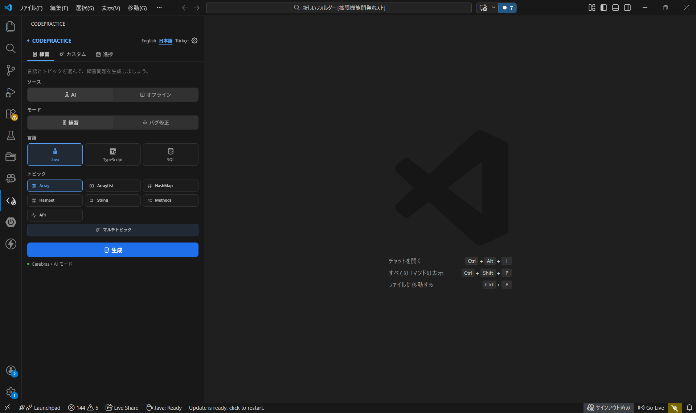
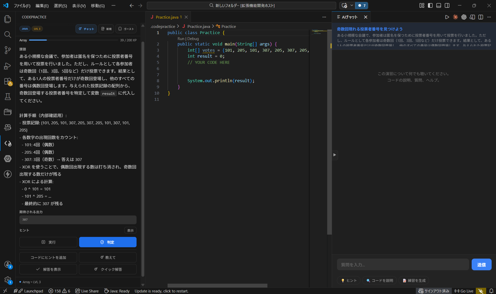
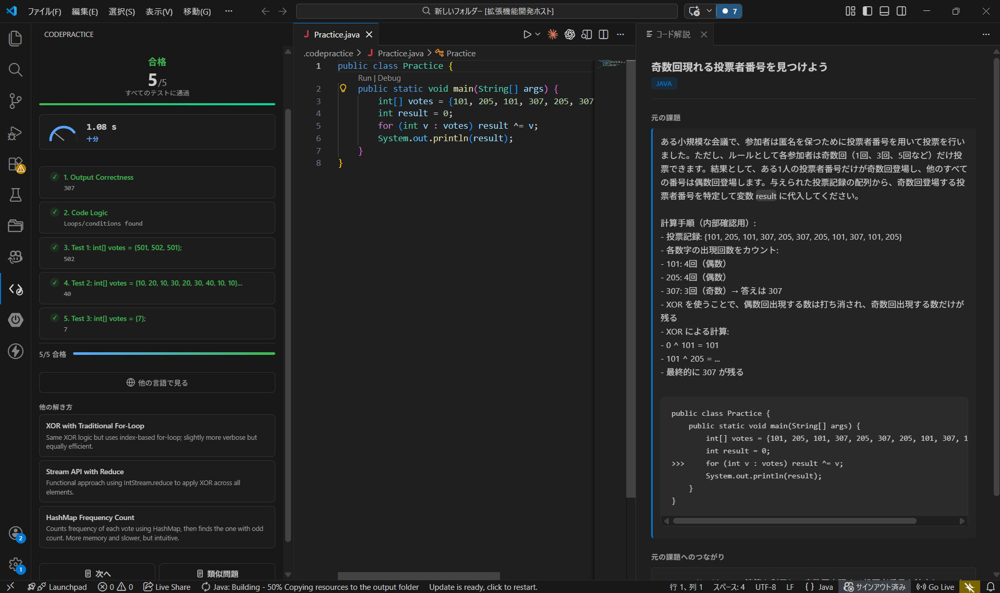

# CodePractice

CodePractice は、VS Code 上でコーディング練習を進めるための拡張機能です。

主な機能:
- Java / TypeScript / SQL の練習問題
- AI モードとオフラインモード
- 実行、判定、ヒント、Quick Solve、解説表示
- 進捗管理と復習機能

## 画面イメージ

### メイン画面

### 演習・判定画面

リポジトリ:
- https://github.com/barankul/codepractice

この README は VSIX パッケージ用の簡易説明です。
